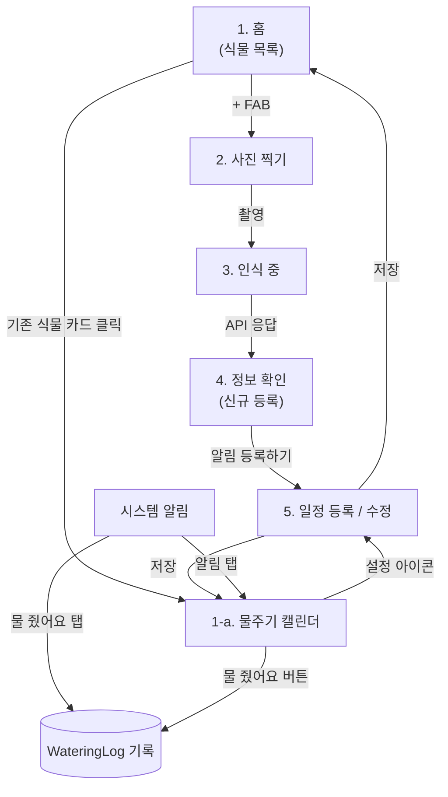

# 식물 관리 앱 — 화면 구성 및 내비게이션 정리

## 전체 흐름도



두 개의 진입 경로가 5번(일정 등록/수정) 화면 하나를 공유합니다.
- **신규 등록 경로**: 홈 → 카메라 → 인식중 → 정보확인 → 일정등록
- **기존 식물 관리 경로**: 홈 → 캘린더 → (설정 아이콘) → 일정수정

---

## 구현 상태 (2026-08-11 기준)

| 화면 | 상태 | 코드 |
|---|---|---|
| 1. 홈 | ✅ 구현 + Room 연동 | `ui/home/HomeScreen.kt` |
| 1-a. 캘린더 | ✅ 구현 완료 (실기기 미확인) | `ui/calendar/CalendarScreen.kt` |
| 2. 사진 찍기 | ✅ 구현 완료 (실기기 미확인) | `ui/camera/CameraScreen.kt` |
| 3. 인식 중 | ✅ 구현 + Gemini 실연동 확인 (`gemini-flash-latest`) | `ui/recognition/RecognitionScreen.kt`, `recognition/GeminiPlantIdentifier.kt` |
| 4. 정보 확인 | ✅ 구현 완료 (실기기 미확인) | `ui/info/InfoScreen.kt` |
| 5. 일정 등록/수정 | ✅ 구현 + Room 연동, 수정모드 연결 완료 | `ui/schedule/ScheduleScreen.kt` |
| 6. 알림 | ✅ 구현 + WorkManager 연동 | `reminder/` 패키지 |
| 식물 삭제 | ✅ 구현 완료 (캘린더 화면에서, 실기기 미확인) | `PlantRepository.deletePlant` + `ReminderScheduler.cancel` |

**남은 것**: 캘린더/알림 실동작 확인(디버그용 1분/5분 테스트 버튼 캘린더 화면에 추가됨), 갤러리 사진 선택 플로우 실기기 확인. (스트레치) TFLite 온디바이스 폴백, 홈 화면 위젯(Glance) — 착수 전.
자세한 작업 이력은 `progress_log.md` 참고.

---

## 화면별 상세

### 1. 홈 (식물 목록)
- 등록된 식물을 카드 리스트(`LazyColumn` + `Card`)로 표시
- 카드: 썸네일 사진, 이름, "다음 물주기까지 D-2" 상태, 빠른 "물 줬어요" 버튼(`FilledTonalButton`)
- 우하단 FAB → 신규 등록 플로우(2번) 시작
- 카드 클릭 → 1-a(캘린더)로 이동

### 1-a. 물주기 캘린더
- 홈에서 식물 카드를 클릭하면 진입
- 월간 캘린더 그리드에 물 준 날짜를 점/채워진 원으로 표시, 오늘 날짜는 테두리만
- 하단에 "마지막 물주기 며칠 전" 요약 텍스트
- 우상단 설정 아이콘 → 5번(일정 수정, 기존 값 프리필) 이동
- "물 줬어요" 버튼 → `WateringLog`에 기록 추가, 캘린더 즉시 갱신

### 2. 사진 찍기
- CameraX 풀스크린 프리뷰
- 원형 셔터 버튼 (터치 타겟 48dp 이상)

### 3. 인식 중
- 촬영한 사진 썸네일 + 로딩 인디케이터(Material 3 Expressive 신규 컴포넌트)
- Gemini API(또는 PlantNet API) 호출 대기 상태
- 실패 시 4번으로 넘어가되 자동 인식 결과 없이 수동 선택 상태로 진입

### 4. 정보 확인 (신규 등록)
- 사진 + 식물 이름(Headline) + 학명(Label)
- 물주기 주기 / 광량 카드 2개
- **API 인식 실패 시 폴백**: 카드 대신 드롭다운으로 직접 종 선택
- 하단 버튼 "알림 등록하기" → 5번(신규 모드)

### 5. 일정 등록 / 수정 (공유 화면)
- "며칠마다 물 줄까요" — `Slider`
- 알림 받을 시간 — `TimePicker`
- 신규 모드: 저장 시 새 `Plant` row 생성 + 홈으로 이동
- 수정 모드: 캘린더에서 진입 시 기존 값 프리필, 저장 시 업데이트 + 캘린더로 복귀

### 6. 알림 (물 줄 시간)
- 시스템 알림에 액션 버튼 2개: "물 줬어요" / "나중에" (앱 안 열어도 처리 가능)
- 알림 자체를 탭하면 1-a(캘린더)로 진입

---

## 데이터 모델 (Room)

```
Plant
- id
- name
- species
- photoUri
- wateringIntervalDays
- reminderTime
- lastWateredAt

WateringLog
- id
- plantId (FK)
- wateredAt
```

- "물 줬어요" 액션(홈 카드 / 캘린더 / 알림) → `WateringLog` insert + `Plant.lastWateredAt` 갱신
- `WorkManager`로 `wateringIntervalDays` 기준 반복 알림 예약

## 기술 스택 메모
- UI: Jetpack Compose, Material 3 Expressive (Android 16+)
- 카메라: CameraX
- 로컬 저장: Room
- 알림/스케줄: WorkManager + NotificationCompat (액션 버튼 포함)
- 식물 인식: Gemini API (Flash/Flash-Lite, 무료 티어) 또는 PlantNet API
- 인식 실패 대비: 수동 선택 드롭다운 폴백 필수

---
*최초 작성: 2026-08-04 대화 기반 정리. 화면/구조가 바뀌면 이 파일을 다시 불러와서 갱신하면 됩니다.*
*2026-08-11: 화면 6개 + 캘린더 + 삭제까지 전부 구현 완료, "구현 상태" 표 추가.*
