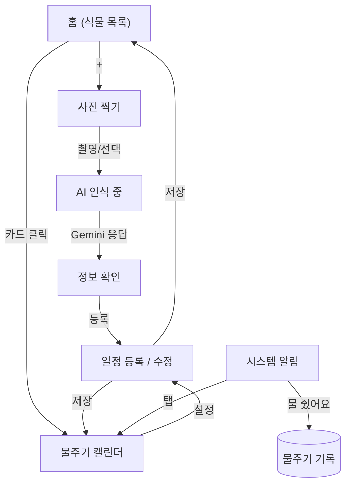

# 🌱 PlantWater

식물 사진을 찍으면 AI가 종을 인식하고, 물주기 일정을 자동으로 잡아 알림까지 보내주는 안드로이드 앱입니다.

카메라로 식물을 촬영하면 Gemini API가 이름 · 학명 · 권장 물주기 주기를 알아서 채워주고, 이후 `WorkManager`가 정해진 주기마다 알림을 보내 물 줬는지 기록하게 합니다. 100% Jetpack Compose로 작성했고, 오프라인 데이터는 Room, 백그라운드 알림은 WorkManager, 촬영은 CameraX로 구현했습니다.

> 1인 개발로 기획부터 구현, 실기기 디버깅까지 전 과정을 진행한 개인 프로젝트입니다.

---

## ✨ 주요 기능

| 기능 | 설명 |
|---|---|
| 📷 사진으로 식물 등록 | CameraX 촬영 또는 갤러리 선택 → Gemini Vision API로 종/학명/물주기 주기 자동 인식 |
| 🔁 인식 실패 폴백 | API 실패·오인식 시 6종 카탈로그에서 수동 선택으로 즉시 전환 (무료 티어 API의 불안정성을 감안한 설계) |
| ⏰ 스마트 알림 | `WorkManager` `PeriodicWorkRequest`로 식물별 반복 알림 예약, 알림에서 "물 줬어요"/"나중에" 즉시 처리 (앱을 열지 않아도 됨) |
| 📅 물주기 캘린더 | 월간 캘린더에 물 준 기록을 시각화, 마지막 물주기 이후 경과일 표시 |
| 🗑 일정 수정/삭제 | 식물 정보·알림 시간 수정, 삭제 시 예약된 알림도 함께 취소 |

## 📱 화면 흐름



## 🛠 기술 스택

- **언어 / UI**: Kotlin, Jetpack Compose, Material 3
- **비동기**: Kotlin Coroutines, Flow
- **로컬 저장소**: Room (KSP)
- **백그라운드 작업**: WorkManager (`CoroutineWorker`, `PeriodicWorkRequest`)
- **카메라**: CameraX (Preview, ImageCapture) + Photo Picker
- **AI 인식**: Google Gemini API (`gemini-flash-latest`, Vision + 구조화 JSON 응답), `HttpURLConnection` 직접 구현으로 SDK 의존성 없이 최소화
- **빌드**: Gradle Kotlin DSL, AGP, KSP

## 🏗 아키텍처

```
app/src/main/java/com/moonkata/plantwater/
├── data/local/        # Room: Entity(Plant, WateringLog), Dao, Database, Repository
├── recognition/        # Gemini API 클라이언트 + 인식 결과 모델 + 수동 폴백 카탈로그
├── reminder/           # WorkManager 스케줄러, 알림 Worker, 액션 BroadcastReceiver
├── ui/
│   ├── home/            # 식물 목록
│   ├── camera/          # 촬영 / 갤러리 선택
│   ├── recognition/     # AI 인식 대기 화면
│   ├── info/             # 인식 결과 확인 / 수동 선택
│   ├── schedule/        # 일정 등록·수정 (신규/수정 공유 화면)
│   ├── calendar/        # 물주기 캘린더
│   └── theme/
└── util/                 # 이미지 다운샘플링 등 공용 유틸
```

Repository 패턴으로 Room 접근을 한 곳에 모으고, 화면들은 `Flow`를 `collectAsState`로 구독해 데이터베이스 변경이 즉시 UI에 반영되도록 했습니다. 화면 전환은 별도 내비게이션 라이브러리 없이 `sealed interface Screen` + `when`으로 직접 구현했습니다.

## 🔍 개발 중 마주친 문제와 해결

실기기 테스트와 실제 API 연동 과정에서 겪은 이슈들입니다. (자세한 기록은 [`01_plan/progress_log.md`](01_plan/progress_log.md))

- **Compose 상태 초기화 버그**: `setContent {}` 최상위에서 `mutableStateOf`를 `remember` 없이 선언 → recomposition마다 상태가 초기값으로 리셋되어 화면 전환이 즉시 원복. `remember { mutableStateOf(...) }`로 감싸 해결하며 Compose 상태 보존 모델을 체득.
- **KSP × AGP 빌드 충돌**: AGP의 built-in Kotlin 기능과 KSP의 `kotlin.sourceSets` DSL 사용 방식이 충돌 ([google/ksp#2729](https://github.com/google/ksp/issues/2729)). `gradle.properties`에 플래그를 추가해 우회.
- **Gemini 모델 단종 대응**: 개발 중 사용하던 고정 모델 버전이 신규 API 키에서 404로 막힘 → 항상 최신 flash 모델을 가리키는 별칭(`gemini-flash-latest`)으로 교체해 안정성 확보.
- **네트워크 타임아웃 튜닝**: 특정 네트워크에서 연결 자체가 안 될 때 기본 타임아웃(15s)이 여러 번 재시도되며 폴백까지 2분 가까이 걸리는 문제 발견 → connect/read 타임아웃을 6s/12s로 낮춰 실패 감지와 수동 입력 폴백 전환 속도 개선.
- **API 불안정성 대비 설계**: 무료 티어 API의 실패 가능성을 처음부터 요구사항에 반영해, 인식 실패 시 자동으로 수동 선택 드롭다운으로 전환되는 폴백 경로를 필수 기능으로 설계.

## 🚀 빌드 방법

```bash
git clone <repo-url>
cd and-plant-water
```

1. [Google AI Studio](https://aistudio.google.com/)에서 Gemini API 키 발급
2. 프로젝트 루트에 `local.properties` 생성 후 추가:
   ```
   GEMINI_API_KEY=your_api_key_here
   ```
3. Android Studio로 열고 실행, 또는:
   ```bash
   ./gradlew assembleDebug
   ```

API 키가 없어도 앱은 실행되며, 인식 단계에서 실패로 처리되어 수동 선택 폴백으로 정상 동작합니다.

## 📌 진행 상황

핵심 플로우(촬영 → AI 인식 → 등록 → 알림 → 캘린더) 전 구간 구현 및 실기기 테스트 완료. 진행 중인 항목:

- [ ] 갤러리 선택 플로우 실기기 최종 검증
- [ ] TFLite 온디바이스 인식 폴백 (스트레치)
- [ ] 홈 화면 위젯 (Glance)

---

*상세 화면 설계는 [`01_plan/plant_app_navigation.md`](01_plan/plant_app_navigation.md), 개발 일지는 [`01_plan/progress_log.md`](01_plan/progress_log.md)에 있습니다.*
