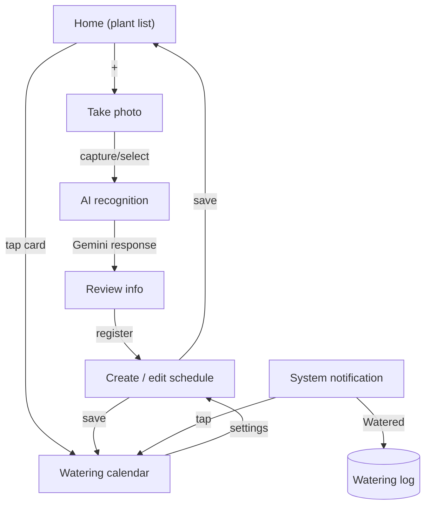

# 🌱 PlantWater

An Android app that identifies a plant species from a photo using AI, then sets up a watering schedule and sends reminder notifications automatically.

Take a photo of a plant and the Gemini API fills in its common name, scientific name, and recommended watering interval. From there, `WorkManager` sends periodic reminders so you never forget to water it, with a "watered" action right on the notification. Built entirely in Jetpack Compose, with Room for offline storage, WorkManager for background reminders, and CameraX for capture.

> Solo project — I designed, built, and debugged the entire app end-to-end on a physical device.

---

## ✨ Features

| Feature | Description |
|---|---|
| 📷 Register a plant by photo | Capture with CameraX or pick from the gallery → the Gemini Vision API automatically fills in species, scientific name, and watering interval |
| 🔁 Fallback on failed recognition | If the API fails or misidentifies the plant, instantly falls back to a 6-entry manual catalog — a deliberate design choice given the instability of the free-tier API |
| ⏰ Smart reminders | `WorkManager` `PeriodicWorkRequest` schedules repeating per-plant reminders; "Watered" / "Later" can be handled right from the notification without opening the app |
| 📅 Watering calendar | Visualizes watering history on a monthly calendar, showing days elapsed since the last watering |
| 🗑 Edit / delete schedules | Edit plant info or reminder time; deleting a plant also cancels its scheduled reminders |

## 📱 Screen Flow



## 🛠 Tech Stack

- **Language / UI**: Kotlin, Jetpack Compose, Material 3
- **Async**: Kotlin Coroutines, Flow
- **Local storage**: Room (KSP)
- **Background work**: WorkManager (`CoroutineWorker`, `PeriodicWorkRequest`)
- **Camera**: CameraX (Preview, ImageCapture) + Photo Picker
- **AI recognition**: Google Gemini API (`gemini-flash-latest`, Vision + structured JSON response), implemented directly over `HttpURLConnection` to avoid an extra SDK dependency
- **Build**: Gradle Kotlin DSL, AGP, KSP

## 🏗 Architecture

```
app/src/main/java/com/moonkata/plantwater/
├── data/local/        # Room: Entities (Plant, WateringLog), Dao, Database, Repository
├── recognition/        # Gemini API client, recognition result model, manual fallback catalog
├── reminder/           # WorkManager scheduler, reminder Worker, action BroadcastReceiver
├── ui/
│   ├── home/            # Plant list
│   ├── camera/          # Capture / gallery selection
│   ├── recognition/     # AI recognition in-progress screen
│   ├── info/             # Review recognition result / manual selection
│   ├── schedule/        # Create & edit schedule (shared screen for both)
│   ├── calendar/        # Watering calendar
│   └── theme/
└── util/                 # Shared utilities (e.g. image downsampling)
```

Room access is centralized behind a repository, and each screen subscribes to a `Flow` via `collectAsState` so database changes are reflected in the UI immediately. Navigation is implemented directly with a `sealed interface Screen` + `when`, without a navigation library.

## 🔍 Problems solved along the way

Issues hit during real-device testing and live API integration (full write-up in [`01_plan/progress_log.md`](01_plan/progress_log.md)):

- **Compose state-reset bug**: declared `mutableStateOf` at the top level of `setContent {}` without `remember`, so state reset to its initial value on every recomposition and screens immediately snapped back. Fixed by wrapping it in `remember { mutableStateOf(...) }` — a hands-on lesson in how Compose preserves state across recomposition.
- **KSP × AGP build conflict**: AGP's built-in Kotlin support conflicted with how KSP uses the `kotlin.sourceSets` DSL ([google/ksp#2729](https://github.com/google/ksp/issues/2729)). Worked around it with a flag in `gradle.properties`.
- **Gemini model deprecation**: the pinned model version used during development started returning 404 on a newly issued API key → switched to the always-current alias (`gemini-flash-latest`) for stability.
- **Network timeout tuning**: on networks where the connection couldn't be established at all, the default 15s timeout was retried multiple times, taking almost 2 minutes to reach the manual fallback. Lowered connect/read timeouts to 6s/12s to detect failure faster and fall back to manual entry sooner.
- **Designing around API instability**: treated the free-tier API's failure modes as a first-class requirement from the start, making the automatic fallback to the manual-selection dropdown a required feature rather than an afterthought.

## 🚀 Building

```bash
git clone https://github.com/katalog/Android-Plant-Water.git
cd Android-Plant-Water
```

1. Get a Gemini API key from [Google AI Studio](https://aistudio.google.com/)
2. Create `local.properties` in the project root and add:
   ```
   GEMINI_API_KEY=your_api_key_here
   ```
3. Open in Android Studio and run, or:
   ```bash
   ./gradlew assembleDebug
   ```

The app still runs without an API key — recognition simply fails and falls back to manual selection.

## 📌 Status

The full core flow (capture → AI recognition → register → reminder → calendar) is implemented and tested on a physical device. In progress:

- [ ] Final on-device verification of the gallery-selection flow
- [ ] On-device TFLite recognition fallback (stretch goal)
- [ ] Home screen widget (Glance)

---

*Detailed screen design in [`01_plan/plant_app_navigation.md`](01_plan/plant_app_navigation.md), dev log in [`01_plan/progress_log.md`](01_plan/progress_log.md).*
